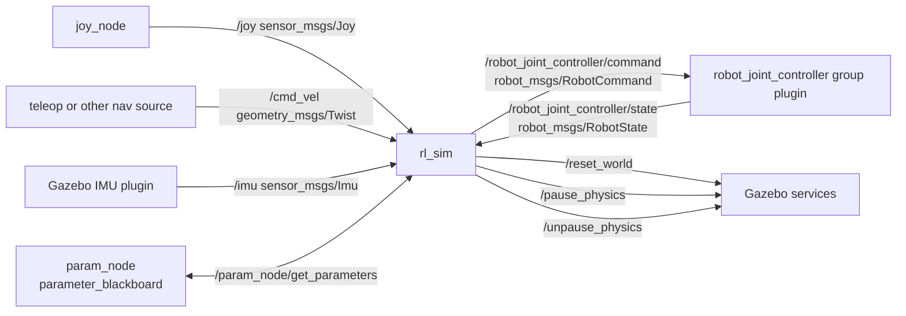

# rl_sar Repository Architecture and Node Logic Flow

## 1. What This Repository Is

`rl_sar` is a ROS/ROS2 + C++ framework for deploying reinforcement-learning (RL) robot controllers in:

- Simulation (Gazebo)
- Real robots (A1, Go2/Go2W, G1, Lite3, L4W4, and others with policy/description support)

The core runtime pattern is:

1. Read robot + policy config from YAML
2. Build observations from robot state
3. Run TorchScript policy
4. Convert actions to joint targets/torques
5. Send commands through either:
   - ROS controller topics (simulation), or
   - Robot vendor SDK channels (real hardware)

## 2. Top-Level Package Layout

`src/` contains these major ROS packages:

- `rl_sar`
  - Main executables: `rl_sim`, `rl_real_a1`, `rl_real_go2`, `rl_real_g1`, `rl_real_lite3`, `rl_real_l4w4`
  - Core runtime libraries (`rl_sdk`, FSM core, loop scheduler, observation buffer)
  - Robot policies (`policy/<robot>/<config>`)
  - Launch files (`launch/gazebo.launch.py` and ROS1 equivalent)
- `robot_msgs`
  - Custom message definitions:
    - `MotorCommand`, `MotorState`, `RobotCommand`, `RobotState`, `IMU`
- `robot_joint_controller`
  - ROS control plugin bridge from `robot_msgs` command/state to effort interfaces
  - ROS2 plugin types:
    - `robot_joint_controller/RobotJointController` (single joint)
    - `robot_joint_controller/RobotJointControllerGroup` (all joints in one message)
- `robots/*_description`
  - URDF/Xacro meshes and ros_control/ros2_control config for each robot family

Also present:

- `library/thirdparty/`: vendor SDKs (Unitree SDK2, Unitree legged SDK, Lite3 SDK, etc.)
- `scripts/actuator_net.py`: actuator network training/eval utility
- `test/test_observation_buffer.cpp`: unit test for observation history buffer

## 3. Runtime Node Inventory

## 3.1 Core Runtime Executables (`rl_sar`)

- `rl_sim` (ROS node name: `rl_sim_node` in ROS2)
  - Simulation control node
  - Publishes robot command message to controller
  - Subscribes robot state / IMU / joystick / cmd_vel
  - Calls Gazebo reset/pause/unpause services
- `rl_real_a1`
- `rl_real_go2`
- `rl_real_g1`
- `rl_real_lite3`
- `rl_real_l4w4`
  - Real-hardware control nodes
  - Run same RL/FSM pipeline, but IO goes through each robot SDK transport
  - Optional ROS `/cmd_vel` input when built with ROS mode
  - Go2 additionally subscribes elevation data for height-scan observation

## 3.2 Launch-Time Helper Nodes (Simulation)

From `src/rl_sar/launch/gazebo.launch.py`:

- `robot_state_publisher`
- Gazebo (included `gazebo_ros` launch)
- `spawn_entity.py`
- `controller_manager` spawner for `joint_state_broadcaster`
- `joy_node`
- `param_node` (`demo_nodes_cpp/parameter_blackboard`)

Note:

- `robot_joint_controller` spawner is intentionally commented in launch and started by `rl_sim` itself (`StartJointController(...)`).

## 3.3 Controller Plugin (Not a Standalone Node)

`robot_joint_controller` is loaded by `controller_manager` and exposes:

- Input topic: `~/command`
- Output topic: `~/state`

For ROS2 group controller (`RobotJointControllerGroup`):

- `~/command` type: `robot_msgs/msg/RobotCommand`
- `~/state` type: `robot_msgs/msg/RobotState`

## 4. Communication Graphs

## 4.1 Simulation (ROS2) Graph



## 4.2 Real Robot (Common Pattern)

```mermaid
flowchart LR
  TELEOP[teleop/nav source] -->|/cmd_vel (optional)| RLREAL[rl_real_*]
  RLREAL -->|SDK command transport| ROBOT[Robot low-level controller]
  ROBOT -->|SDK state transport| RLREAL
```

Real transport differs by executable:

- `rl_real_a1`: Unitree legged SDK UDP
- `rl_real_go2`: Unitree SDK2 DDS channels
  - `rt/lowcmd`, `rt/lowstate`, `rt/wirelesscontroller`
  - extra ROS2 input: `/go2_1/local_elevation_array` (`Float32MultiArray`)
- `rl_real_g1`: Unitree SDK2 DDS channels
  - `rt/lowcmd`, `rt/lowstate`, `rt/secondary_imu`
- `rl_real_lite3`: Lite3 Motion SDK sender/receiver + Retroid gamepad UDP
- `rl_real_l4w4`: l4w4 SDK UDP

## 5. Per-Node Responsibilities

## 5.1 `rl_sim`

Main responsibilities:

- Discover `robot_name` and `gazebo_model_name` from `param_node`
- Read base config (`policy/<robot>/base.yaml`)
- Create/attach robot FSM via `FSMManager`
- Spawn `robot_joint_controller` with joint list parameter
- Subscribe:
  - `/cmd_vel`
  - `/joy`
  - `/imu`
  - `/robot_joint_controller/state`
- Publish:
  - `/robot_joint_controller/command`
- Service clients:
  - `/reset_world`
  - `/pause_physics`
  - `/unpause_physics`

Threaded loop model:

- `loop_keyboard`: 20 Hz keyboard polling
- `loop_control`: `dt` period (from base YAML)
- `loop_rl`: `dt * decimation` period

## 5.2 `rl_real_*` Nodes

Shared behavior:

- Read base YAML
- Build FSM for robot type
- Run concurrent loops (keyboard + control + rl)
- In `GetState`: read SDK feedback + parse gamepad buttons into common control enum
- In `RunModel`: compute obs, run TorchScript, push output tensors to queues
- In FSM RL states: pop queues and write final motor command
- In `SetCommand`: serialize and send low-level command through SDK transport

ROS-side IO in real nodes:

- All real nodes can subscribe `/cmd_vel` in ROS build mode
- `rl_real_go2` also subscribes `/go2_1/local_elevation_array` and injects height map into observation

## 5.3 `robot_joint_controller` (ROS2 group)

Role:

- Converts high-level `RobotCommand` (q/dq/kp/kd/tau per joint) into effort interface commands
- Reads URDF limits and clamps position/velocity/effort
- Publishes estimated state (`RobotState`) for feedback loop

How it is configured:

- `rl_sim` writes temporary YAML containing `joints: [...]`
- `controller_manager spawner` starts `robot_joint_controller`
- Controller subscribes `~/command` and publishes `~/state`

## 6. Control Logic Flow (End-to-End)

Each control cycle effectively does:

1. Acquire latest robot state (`GetState`)
2. FSM dispatch (`StateController`) chooses one of:
   - Passive
   - GetUp
   - GetDown
   - RL locomotion/skill state
3. RL thread (`RunModel`) computes:
   - observation tensor
   - policy action tensor
   - target dof pos/vel/tau
4. FSM RL state consumes queued outputs and fills `RobotCommand`
5. Command transport (`SetCommand`) writes to ROS controller topic (sim) or SDK (real)

## 7. FSM and Policy Selection

FSM registration:

- `policy/fsm.hpp` includes all robot FSM factories
- Each robot `policy/<robot>/fsm.hpp` registers itself with `REGISTER_FSM_FACTORY(...)`
- Initial state is generally `RLFSMStatePassive`

Typical transition pattern:

- `Passive` -> (`Num0` or gamepad `A`) -> `GetUp`
- `GetUp` -> (`Num1` or `RB+DPadUp`) -> `RL_Locomotion`
- `RL_Locomotion` -> (`Num9`/`B`) -> `GetDown`
- Any active state -> (`P` or `LB+X`) -> `Passive`

Policy config loading:

- Base robot params: `policy/<robot>/base.yaml`
- RL config/model: `policy/<robot>/<config>/config.yaml` + TorchScript model file
- `config_name` is selected inside each robot FSM state (for example `go2` defaults to `dreamwaq`)

## 8. Simulation Controller Integration Details

Robot description packages provide:

- Xacro/URDF model
- `gazebo_ros2_control` plugin setup in `xacro/gazebo.xacro`
- Controller config YAML (`config/robot_control_ros2.yaml`) defining:
  - `joint_state_broadcaster`
  - `imu_sensor_broadcaster`
  - `robot_joint_controller` as `RobotJointControllerGroup`

So simulation command chain is:

`rl_sim` -> `robot_joint_controller` -> ros2_control effort interface -> Gazebo joints

and feedback chain is:

Gazebo joint/imu state -> broadcasters/controller state topic -> `rl_sim`

## 9. Message Contracts Used Between Nodes

`robot_msgs` key contracts:

- `MotorCommand`: `q`, `dq`, `tau`, `kp`, `kd`
- `MotorState`: `q`, `dq`, `tau_est` (+ fields for ddq/current)
- `RobotCommand`: `MotorCommand[] motor_command`
- `RobotState`: `IMU imu` + `MotorState[] motor_state`

This contract is the core interface between `rl_sim` and `robot_joint_controller` in ROS2 simulation mode.

## 10. Useful Runtime Introspection

When running simulation, these commands help verify wiring:

```bash
ros2 node list
ros2 topic list
ros2 topic echo /robot_joint_controller/state
ros2 topic hz /robot_joint_controller/state
ros2 service list | grep physics
```

For real Go2 height-map input:

```bash
ros2 topic hz /go2_1/local_elevation_array
```

## 11. Practical Summary

- `rl_sar` provides the policy/FSM/control runtime.
- `robot_joint_controller` is the ROS control bridge for simulation.
- `robot_msgs` defines the message ABI between them.
- `robots/*_description` packages define robot models + controller manager config.
- Simulation path is ROS topic/service based.
- Real path uses robot vendor SDK transport, with optional ROS `/cmd_vel` and other auxiliary inputs.

